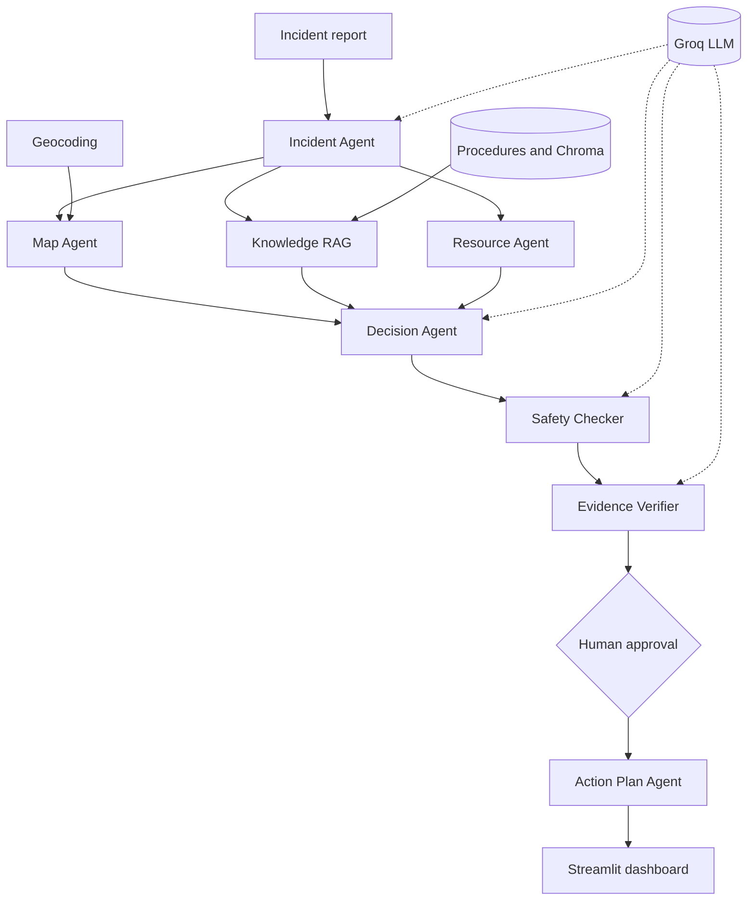

# Smart Emergency Incident Response System

## 1. Architecture Diagram

The presentation layer is `app.py`. The orchestration layer is `graph.py` and `state.py`. Agent modules perform analysis, enrichment, validation, approval, and plan generation. Groq, geocoding, local procedure files, Chroma, and embeddings are integration boundaries. Human approval is the authorization boundary.

## 2. Agent Workflow Design

| Stage | Responsibility | Output | Failure path |
|---|---|---|---|
| Incident Agent | Extract incident facts | Location, type, severity, people at risk | Normalize model output; surface model failure for review. |
| Map Agent | Resolve location | Coordinates and distance | Use safe default coordinates. |
| Knowledge RAG | Retrieve procedures | Relevant emergency procedures | Use generic procedure fallback. |
| Resource Agent | Assess resources | Simulated units and ETA | Continue with local simulation; no external dispatch is claimed. |
| Decision Agent | Recommend response | Initial decision | Send recommendation to safety and evidence gates. |
| Safety Checker | Validate safety | Safety status and notes | Flag concerns and block authorization. |
| Evidence Verifier | Check support | Summary and unsupported claims | Keep unverifiable claims visible. |
| Human Approval Agent | Capture reviewer decision | Approval status and comments | Pending or rejected plans remain unauthorized. |
| Action Plan Agent | Produce final response | Readable action plan | Authorization remains constrained by all gates. |

The workflow fans out from incident analysis to map, RAG, and resource enrichment, then fans in to decision generation before sequential safety, evidence, human approval, and action-plan stages.

## 3. Deployment Strategy

The current application runs locally with `python -m streamlit run app.py`, reads configuration from `.env`, and keeps review history in the Streamlit session. For production, use a pinned container behind HTTPS and authenticated access, durable storage for incidents and approvals, managed procedure/vector storage, bounded retries and timeouts, and separate development, staging, and production environments. Release only after dependency, integration, safety, and prompt-regression tests; keep rollback support.

## 4. Security Model

| Area | Current implementation | Production requirement |
|---|---|---|
| Identity | No application authentication is implemented. | SSO, MFA, and role-based access. |
| Authorization | Explicit approval state gates deployment. | Bind approval to an authenticated reviewer and enforce it server-side. |
| Secrets | `GROQ_API_KEY` is loaded from `.env`. | Use a managed secret store and rotation. |
| Privacy | Incident text may be sent to configured model services. | Minimize retention, redact sensitive data, and document vendor processing. |
| Guardrails | Parsing, safety checks, evidence checks, and human review. | Add policy tests, prompt-injection defenses, and model allowlists. |
| Audit | Trace and session review history are visible/exportable. | Persist tamper-evident audit events with actor and timestamp. |

This is decision support, not an autonomous replacement for emergency services. Operators must validate results against local policy and live conditions.

## 5. Monitoring Dashboard Design

The dashboard should track workflow success rate, per-agent latency, model and retrieval errors, fallback counts, run traces, extraction completeness, evidence-supported claim rate, safety failures, blocked authorizations, unsupported claims, unresolved reviews, model calls, token and embedding usage, review time, approval rate, rejection reasons, and resource ETA accuracy. Alert on repeated safety failures, missing approvals, latency spikes, model errors, and retrieval outages while protecting incident data from unauthorized viewers.

## Complete Application Source Code

The complete source code is included in this repository:

- `app.py`: Streamlit interface and review history.
- `graph.py`: LangGraph workflow.
- `state.py`: Shared state contract.
- `llm.py`: Groq configuration.
- `incident_agent.py`, `map_agent.py`, `knowledge_rag.py`, `resource_agent.py`, `decision_agent.py`, `safety_checker.py`, `evidence_verifier.py`, `human_approval_agent.py`, `action_plan_agent.py`: application agents.
- `requirements.txt` and `.env.example`: dependencies and configuration template.